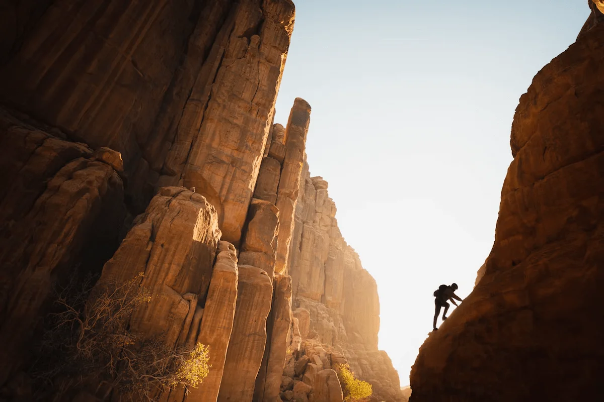
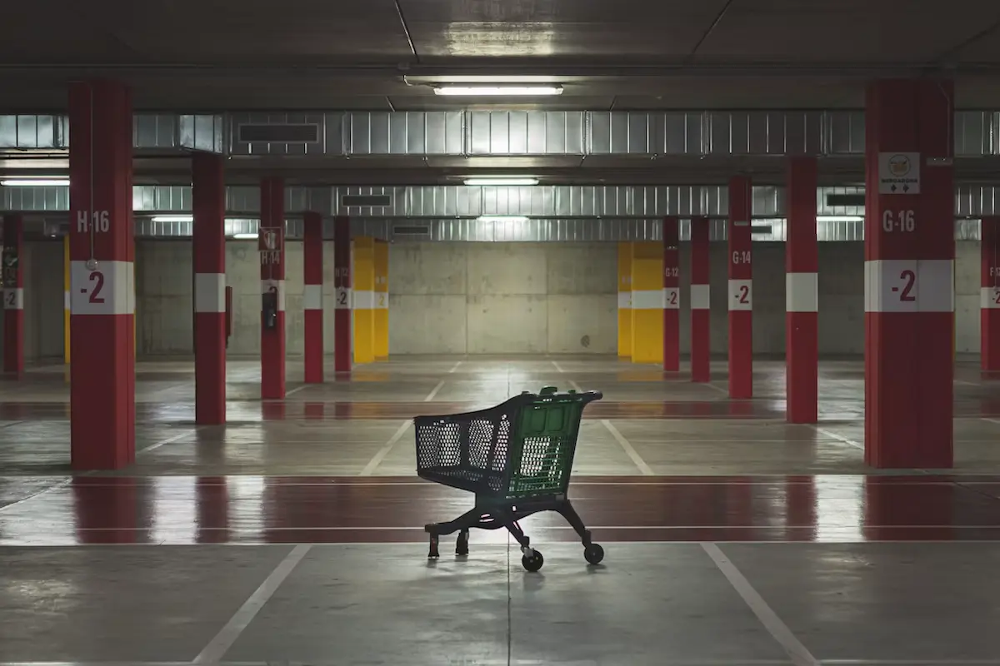
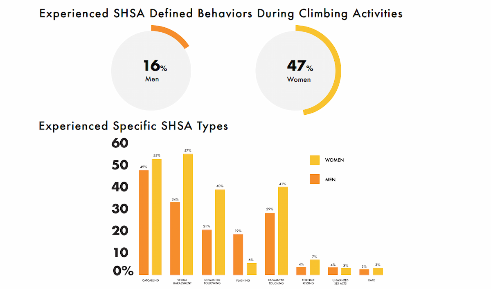
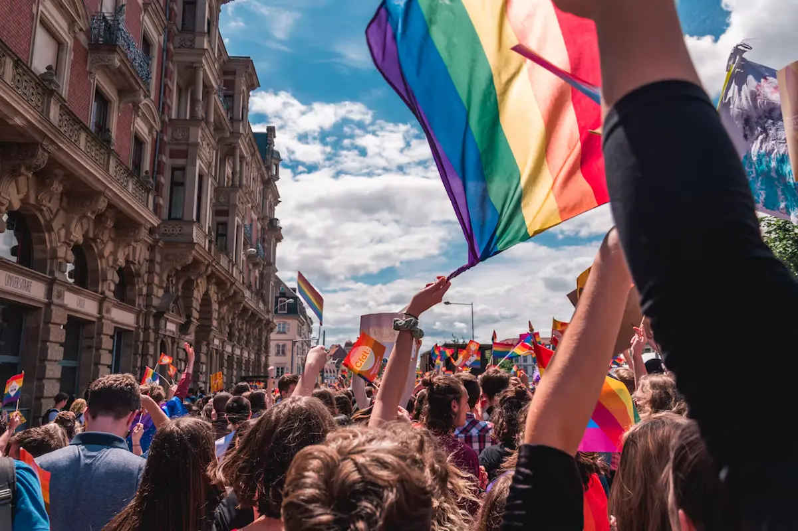
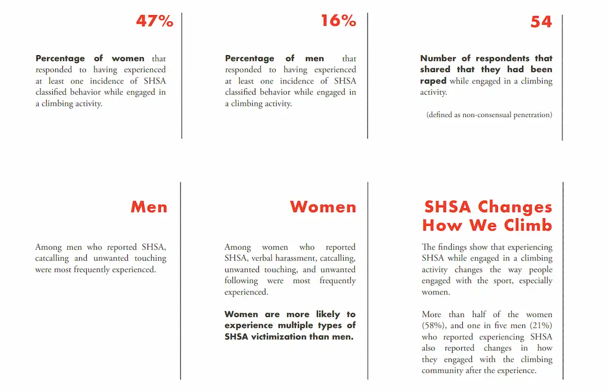
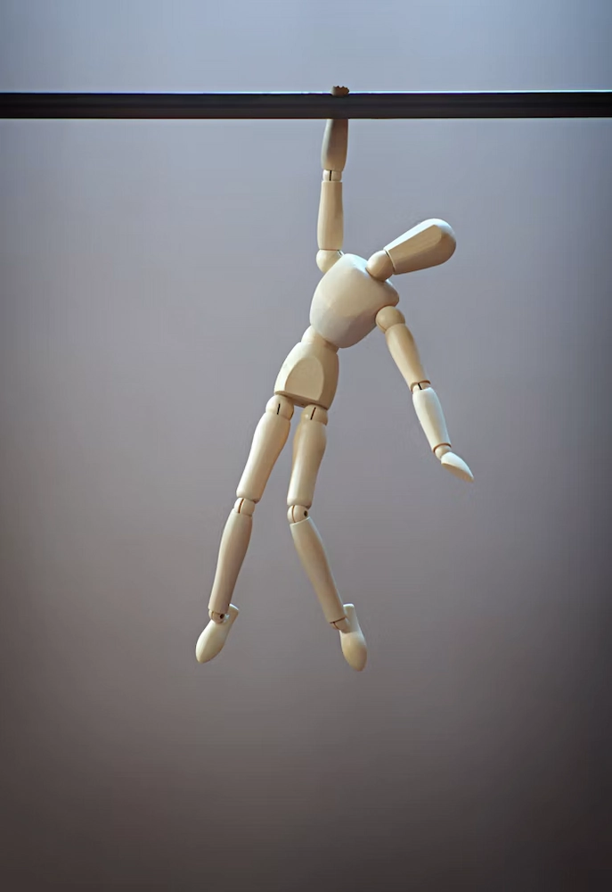

<!-- METADATA: all required fields including keywords plus Status: hidden; no Issue field. -->

# Project Safe Outside and Capitalist Realism

*Photo by [NEOM](https://unsplash.com/@neom) on [Unsplash](https://unsplash.com/)*
<!-- IMAGE: converted from AVIF and resized; added alt text. -->

## Table of Contents

1. [Relation to Gender and Data Activism](#relation-to-gender-and-data-activism)
2. [Objectives of The Project](#objectives-of-the-project)
3. [Relation to Capitalist Realism](#relation-to-capitalist-realism)

---
<!-- STYLING: Table of contents included as a list. -->

The project [#SafeOutside](https://americanalpineclub.org/safeoutside) is a grassroots initiative intended to combat sexual harassment and sexual assault (SHSA) as it occurs among communities of climbers and others who enjoy wilderness activities. The initiative has worked closely with nonprofits, industries and press organizations to compile data for the purposes of generating awareness around SHSA and implementing policies where possible. This endeavour has culminated in the creation of two sources, a [Report](https://liamrobertsonportfolio.wordpress.com/wp-content/uploads/2026/02/7609b-safeoutside-shsa-report28129.pdf) on SHSA in climbing communities and a [Toolkit](https://drive.google.com/drive/folders/1MRzORUWIj8eyCK4skIEextPEybw-gpgc) for helping others collect their own data to help in this initiative. The critical framework of capitalist realism, as detailed by Mark Fisher, presents this project as an aspect of capitalism, woven into the system and therefore reliant on its ideologies. The initiative officially describes its mission as follows:

> #SafeOutside's mission is to combat SHSA. Our first step is to collect data and create a safer space for conversation. We worked with nonprofit, industry and press organizations to generate awareness around SHSA, as well as to implement or refine processes and policies. Our experiences and work to date resulted in two major outputs: a report about SHSA in climbing that presents our collected data and its analysis, and a toolkit that includes templates, guidelines and best practices to help others collect their own data and address this issue. The report and toolkit are meant to be leveraged by anyone in any industry who may wish to combat SHSA. [^1]
<!-- STYLING: Blockquote incorporated into the markdown file. -->

While this project has good intentions, it is still a product of capitalism and cannot escape from the need for monetary compensation. The project #SafeOutside receives funding from the [American Alpine Club](https://americanalpineclub.org/) which is a nonprofit and tries to outsource work to helpful volunteers where possible. Those working on this project exist within a capitalist society, as such they must receive compensation for their work if they wish to have access to vital resources such as food and shelter. Despite this, the project tries to resist capitalist principles in some ways. While outsourcing work saves on costs, it also partially separates the project from monetary compensation, instead relying on the volunteer labour of those passionate about this issue.

*Photo by [Xavi Cabrera](https://unsplash.com/@xavi_cabrera) on [Unsplash](https://unsplash.com/)*
<!-- IMAGE: converted from AVIF and resized; added alt text. -->

## Relation to Gender and Data Activism

The project #SafeOutside relates to gender in a fundamental way, as the initiative was started to combat incidents of SHSA. Sexual harassment and assault are immensely upsetting occurrences that directly relate to an individual’s gender identity and loss of bodily autonomy. Additionally, layers of trauma are added among gender diverse people who have experienced SHSA, as being abused in such a way may have *additional social implications* if their gender expression does not match the gender they were assigned at birth. In this way, the project is representative of gender in regards to social and identity differences. To this extent, the project engages in data activism by bringing attention to SHSA as it occurs within climbing and wilderness communities.

*Figure 1. Lieu & Rennison, 2018.*
<!-- IMAGE: converted from PNG and resized; added alt text. -->

The main aspect of social activism is carried out through the [SHSA Report](https://liamrobertsonportfolio.wordpress.com/wp-content/uploads/2026/02/7609b-safeoutside-shsa-report28129.pdf). This report compiled the information obtained through surveys issued by 40 organizations and a great number of individuals in 2018. The report itself outlines the need for climbers to feel safe from incidents of discrimination, harassment and assault. It advances this goal through a series of graphs and charts, which detail the identity markers of those who have participated in the survey. The survey then breaks the results on SHSA into the categories of men and women, leaving gender diverse individuals out of the aggregate data. This is extremely damaging to individuals who identify outside of the gender binary, especially because these individuals experience higher incident rates of SHSA than their cisgender peers with just under half of all genderqueer individuals experiencing sexual assault at least once in their lifetime.[^2] While transgender people will be represented in the binary categories, non-binary and other gender diverse individuals *are excluded* despite the high incident rates of SHSA in these groups.

In terms of data relating to harassment and assault, 47% of women reported experiencing SHSA while climbing, while only 16% of men reported the same. These numbers reinforce the idea that SHSA is an issue which predominately affects women and not men. While it is true that more women experience this form of harassment and assault, men are also involved in this power structure both as aggressors and victims. Because of the stigma surrounding SHSA and men, many participants of the survey who identify as male may have entered incorrect information for fear of appearing weak, as male victims of SHSA are often presented as such in popular media. By breaking these gendered divisions surrounding SHSA, men can become more aware of the physical and psychological damage these incidents cause, leading to fewer male perpetrators of SHSA and increased visibility among male victims of SHSA.

*Photo by [Margaux Bellott](https://unsplash.com/@mxrgo) on [Unsplash](https://unsplash.com/)*
<!-- IMAGE: converted from AVIF and resized; added alt text. -->

## Objectives of The Project

The project makes the argument that individuals need to inform themselves about SHSA in its many forms, so that they understand when it has happened and what they can do to help victims. When combined with the gendered divisions of data from the graphs in the survey, gender identity as a difference is reinforced by separating the binary and displaying women as the primary victims. In this way, the project argues that men have an *extra responsibility* to educate themselves on SHSA so that they can address or prevent these incidents where possible. The report directly advises bystanders to intervene when it is safe to do so, with distraction being a valid secondary alternative. The project also calls for organizations to take a harder stand against SHSA, so that these actions can be prevented before they happen. This includes refraining from making jokes or using materials that reference SHSA in a positive or neutral way. The project argues that SHSA is a predominately social issue and by changing our perspectives surrounding the issue we can collectively help to combat this pervasive issue in society.

*Figure 1. Lieu & Rennison, 2018.*
<!-- IMAGE: converted from PNG and resized; added alt text. -->

## Relation to Capitalist Realism

SHSA among climbers is presented in a somewhat similar way to capitalist realism as outlined by Mark Fisher. Fisher makes the argument that capitalist realism has made it extremely difficult to imagine other forms of governance outside of capitalism, leading to the continued recycling of ideas in media and apathy among the younger generations.[^3] The aggregate survey directly states that it is “ unlikely that we will ever fully stamp out sexual harassment and assault."[^4] In the same way that our society has started to stagnate under capitalist realism, attitudes towards SHSA have also begun to stagnate with many viewing these horrible actions as an *unstoppable issue* in our society. In this way, much in the same way that it is difficult to imagine a world without capitalism, it is also difficult to imagine a world without SHSA, at least to some degree. In this way, we begin to lose hope that any significant change is possible and fail to adequately address SHSA when it occurs. Capitalist realism ultimately reduces the cultural and historic significance of different artifacts, time-periods and stylistic patterns into marketable objects with defined monetary values. In this way SHSA does the same, by reducing the bodily autonomy of an individual and treating their body as an object the human is inducted into capitalism as a sexual commodity.

\
*Photo by [Marco Bianchetti](https://unsplash.com/@marcobian) on [Unsplash](https://unsplash.com/)*
<!-- IMAGE: converted from AVIF and resized; added alt text. -->

In a sense, capitalist realism surrounds the culture of SHSA as those who perpetrate such actions view their victims as sexual objects, rather than people with their own motivations and sense of agency. According to the framework of capitalist realism, capitalism is an ideology which can permeate every aspect of society, creating a system which objectifies individuals and treats them like objects. The project tries to break the system of reflexive apathy which is experienced by those living under capitalist realism. By calling the individual user to action and demonstrating how they can individually make a positive impact in their community, the program reduces the scope of capitalist realism to a smaller community of rock climbers. This project is therefore able to organize a large enough group of people to resist the effects of reflexive impotence, breaking the cycle and resisting the system of capitalist realism. One person cannot fix an issue like SHSA, but an *entire community* working together can address and hopefully prevent many future occurrences of these actions.

[^1]: “Safe Outside.” American Alpine Club. Accessed February 8, 2026. [https://americanalpineclub.org/safeoutside](https://americanalpineclub.org/safeoutside).
[^2]: Canan, Sasha N, Jesse Denniston-Lee, and Kristen N Jozkowski. “Descriptive Data of Transgender and Nonbinary People’s Experiences of Sexual Assault: Context, Perpetrator Characteristics, and Reporting Behaviors.” PubMed, 2024. [https://pubmed.ncbi.nlm.nih.gov/38100176/](https://pubmed.ncbi.nlm.nih.gov/38100176/).
[^3]: Fisher, Mark. Capitalist realism: Is there no alternative? Zero Books, 2009.
[^4]: Lieu, Charlie, and Callie Marie Rennison. Sexual Harassment and Sexual Assault in the Climbing Community, 2018.
